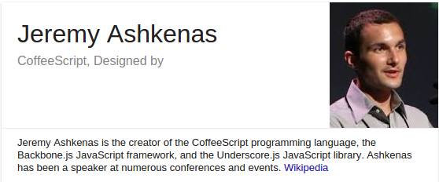
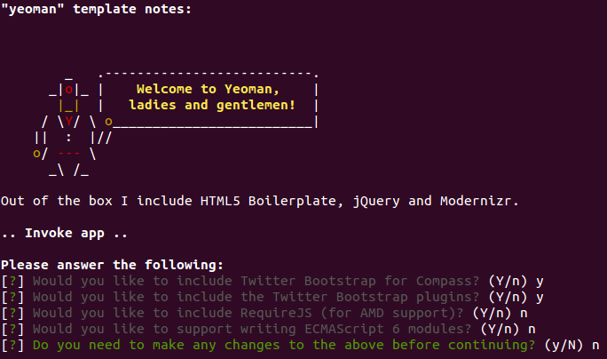
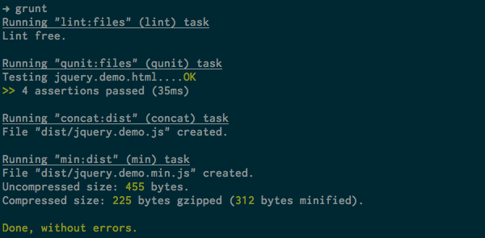
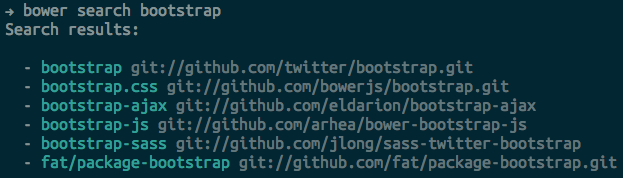
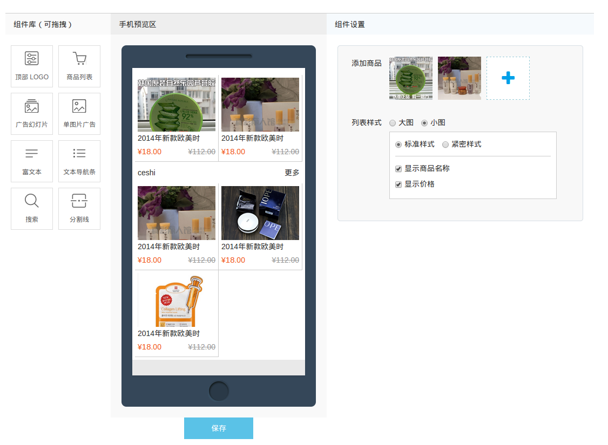

# 基于 backbone 开发 spa 应用

author: 马陆骋&lt;ma.lc@vcooline.com&gt;

## 目录

- 什么是 backbone
- 什么是 spa
- 开发spa和传统页面的区别
- 如何开发一个spa
- 开发语言
- 构建工具
- backbone的组成
- tips
- demo

## 什么是 backbone

> Backbone.js gives structure to web applications by providing models with
key-value binding and custom events, collections with a rich API of
enumerable functions, views with declarative event handling, and
connects it all to your existing API over a RESTful JSON interface.

### backbone 的 MV\*

In Smalltalk-80’s MVC, the View and Controller both observe the Model:

> Rails does not notify views from the model or controllers - it just
passes model data directly to the view.

## 什么是 spa

single page application


### spa 的优势

-   (使用) 用户体验更好
-   (开发) 前后端分离
-   (性能) 请求量少


### spa 的不足

-   对SEO支持不是太好
-   首屏加载慢
-   入门门槛高


### spa 的适用场景

-   应用型而非展示型
-   在大型应用中局部嵌入

## 开发体验

-   无需关心后台业务逻辑 (只需要和 api 进行交互)
-   统一语言 **javascript**

### 如何开发一个 spa

-   编程语言: javascript(coffeescript)
-   构建工具: yeoman(grunt, bower)
-   后端支持: 推荐但不限于 restful 接口
-   本地数据: 数据持久化在浏览器端

### 编程语言 - javascript

-   这里的 javascript 是一门真正的编程语言
-   与操作 dom 时的脚本语言javascript不同
-   是面向对象的 javascript (Object Orient)

### 编程语言 - coffeescript

-   什么是 coffeescript
-   语法简介




## 什么是 coffeescript

CoffeeScript is a little language that compiles into JavaScript

### 定义变量

```coffee
  number   = 42
  opposite = true
```

-   无需 \`var\`, 默认就是局部变量, 预防不良代码


### 定义方法

``` coffee
square = (x) -> x * x
cube   = (x) -> square(x) * x
```

-   减少冗长的 \`function\` 书写


### 条件分支

```coffee
grade = (student) ->
  if student.excellentWork
    "A+"
  else if student.okayStuff
    if student.triedHard then "B" else "B-"
  else
    "C"

eldest = if 24 > 21 then "Liz" else "Ike"
```

-   没有各种圆括号和方括号


### 注释

```coffee
# this is a comment
```

-   ruby 风格注释


### loops

```coffee
for animal in animals
  console.log animal
```

-   写过 js 原生循环的都觉得这个爽


## 构建工具

-   yeoman (脚手架)
-   grunt (构建工具)
-   bower (包管理器)

## install

-   use npm


### yo

```bash
npm install -g yo
```




### grunt

```bash
npm install -g grunt-cli
```




### bower

```bash
npm install -g bower
```




## yoeman

THE WEB'S SCAFFOLDING TOOL FOR MODERN WEBAPPS


## grunt

The JavaScript Task Runner

build tool like rake for ruby and ant(maven) for java


## bower

A package manager for the web


## backbone的组成


-   model
-   collection
-   view
-   routes
-   **controller**


### 架构


### model

数据结构的载体, 以及与服务端 api 的交互


### collection

模型的集合, 方便开发者对一个以上的模型进行操作


### view

view 是 backbone 的核心组件, 负责事件的绑定和 template 的渲染

-   可以嵌套
-   可以继承
-   绑定数据
-   手动管理内存
-   传统 mvc 中 c 的位置


### controller

backbone 没有专门的 controller, controller 的职责由 view 承担


### route

单页应用中路由是可选的,它甚至不是 mvc 的一部分. 路由主要用途就是根据 url
决定页面的状态

## tips

### object 的引用

在 JavaScript 中, object 是通过引用传递的,
所以如果一个对象的某个默认值是一个 object. 那么需要把 default
作为一个函数来定义

```coffee
  defaults: ->
    page_id: ""
    position: 0
    settings: {}
    status: "unable"
    template_type: ""
```


### 手动管理 view

view 需要被手动管理不然会出现多重事件绑定

    if window.current_settings_view
      window.current_settings_view.remove() # make sure view events removed


### 忘掉 jQuery

不要用 jQuery 的思想去创建 dom 元素, 要把这些元素绑定到模型,
这样模型更新时 dom 会自定被更新


## demo



## Thanks

Question?
