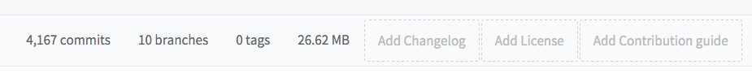
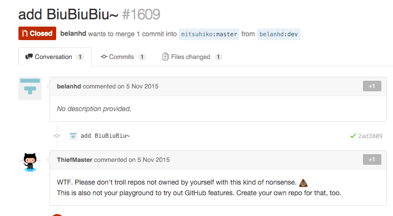
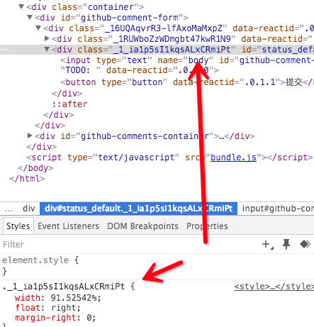
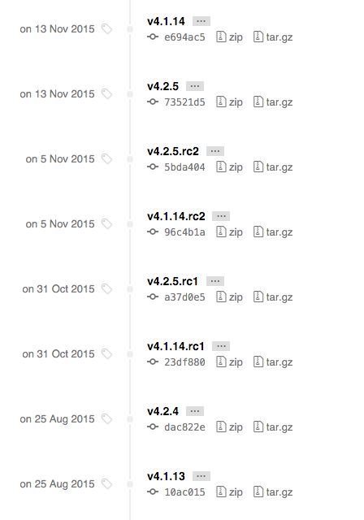

# 我的开源时代

author: 马陆骋 <malucheng@boohee.com>

- 开发一个基于 GitHub API 的开源评论系统

- 所涉及到的相关技术&工具&思想

## Why

为什么做这次分享

为什么要开发（参与）开源项目

### 具体

- 新技术
- 新平台
- 新趋势
- 新思想

### 宏观

不止于『写代码』，从更高的视角参与『软件开发』。

https://assets.thoughtworks.com/assets/technology-radar-nov-2015-cn.pdf

### 实践

- 试炼最新的技术
- 可以在没有进度压力的情况下进行项目管理
- 有充足的时间打磨细节
- 与他人交流，提升自己的知名度
- Learn by doing 是最好的学习方式

## 开源项目的要素

- README
- LICENSE
- CHANGELOG
- CONTRIBUTING

### 有意义

GitHub 不是当网盘来用的（虽然没说一定不可以这样）

但是托管的项目是要有意义的。

一堆没有组织的零散的代码就连对自己的意义都不大。

其他人就更无法获得什么了，别说来参与了。

http://tom.preston-werner.com/2010/08/23/readme-driven-development.html

### 许可证

不是说你把一坨代码放到 GitHub 之类的公共场所就是开源了

如果不选择一个许可证的话，默认情况你的代码是不能被他人使用的。

http://choosealicense.com/

### 负责任

有必要对历史上使用过你的代码的用户说明新的代码更新了什么。

比如修复了哪些 bug。

有什么新的特性加入。

特别是有不向下兼容的修改时。

### 参与者

开源项目最大的特点就是所有人都能参与进来。

能把做过贡献的人的名单列出来那想必是极好的。

## 如何参与开源项目

- 提（回复）issue
- 提 pull request
- 编辑 wiki

### 注意素质

### pull request 的流程

https://help.github.com/articles/using-pull-requests/

### 勿以善小而不为

- 错别字
- 格式排版
- 提小的bug或建议（搜索过无类似历史）

## GitHub Comments

一个社会化的 [GitHub 评论系统](http://www.songofcode.com/github-comment/)。

- 以 jekyll 为代表的的静态博客（站点）工具的流行
- 但是缺乏动态网站的与用户的交互能力是硬伤
- 而评论功能是其中非常重要的一点
- 并且第三方评论系统([disqus](https://disqus.com/),[多说](http://duoshuo.com/))不给力（墙，备案，服务等因素）
- 一个可供学习，self host 的开源实现

### 安装

### 一行 javascript

    

### 必要的 html 结构

    

### 一个已经存在的 GitHub Issue

当前 v0.1.0 版本需要, 以后会做成(半)自动化

### demo

## 整体架构

    +-------------+       +-------------------+       +----------+
    |             |       |                   |       |          |
    | client      |       | nodejs (express)  |       |  GitHub  |
    | javascript  +-----> | application       +------>+          |
    |             |       |                   |       |   API    |
    |             |       | heroku server     |       |          |
    | static page | <---+ | or                | <-----+  Server  |
    |             |       | self host server  |       |          |
    |             |       |                   |       |          |
    +-------------+       +-------------------+       +----------+    

### 客户端

纯 javascript 构建的一个 web ui

- 初始化 ui
- 读取已有数据(评论)
- 生成评论表单
- 与服务端交互

### 服务端

nodejs 构建的 API 服务, 负责 client 和 GitHub API 的中转

- SaaS 平台
- 处理客户端请求
- 和 GitHub API 交互

## 技术选型

### 用户系统与储存方案

- GitHub API

使用 oauth2 协议获取 GitHub 的用户信息与一定的权限

使用 GitHub 的 issues 系统储存评论信息

免去了自己维护数据的成本

[GitHub API](https://developer.github.com/v3/) 是学习 API 设计的绝好例子。

### 语言与框架

#### Node.js

[nodejs](https://nodejs.org/)

Web development in a dynamic language (JavaScript) on a VM that is incredibly fast (V8)

- I/O bound Applications
- Data Streaming Applications
- Data Intensive Real time Applications (DIRT)
- JSON APIs based Applications
- Single Page Applications

#### Express

[express](http://expressjs.com/) 类似于 ruby 的 sinatra

是一个轻量级的 web 开发框架

#### Client

- vanilla JavaScript
- react (developing)

第一版直接果写了客户端的 js，先保证可用性。

目前正在用 react 重写客户端。

### 构建工具

- webpack
- travis

[webpack](https://webpack.github.io/) 是当前最先进的 web 构建工具。

[travis](https://travis-ci.org/) 是一个对 GitHub 开源项目提供免费服务的 ci 工具。

### 应用部署环境

- heroku

[heroku](http://heroku.com/) 是一个 PaaS 平台

Ruby 之父松本行弘就职的公司。

### 官网部署环境

- github pages
- middleman

[GitHub page](https://pages.github.com/) 为静态页面提供 web server 服务（jekyll 作为引擎）。

[middleman](https://middlemanapp.com/) 是由 thoughtbot 开发的一个由 Ruby 编写的静态网站构建工具。

### Misc

一些术语, 稍后解释

- SPA
- Commitizen
- Semantic Versioning
- 12factor

## 碰到的问题与参考实现

面向问题, 而非具体的技术实现方案.

软件开发中会碰到的问题是相对稳定的.

而新技术一直不断涌现.

它们会从不同角度去解决同一个问题.

所以我觉得站在问题的角度去看技术会更清楚.

## 跨域资源共享

Cross-Origin Resource Sharing

服务端和客户端默认是不允许不同域名下的请求进行资源共享的

http://www.sitepoint.com/an-in-depth-look-at-cors/

### 客户端配置

    var xhr = new XMLHttpRequest();
    xhr.withCredentials = true;

### 服务端配置

    res.setHeader('Access-Control-Allow-Origin', req.headers.origin);
    res.setHeader('Access-Control-Allow-Methods', 'GET, POST, OPTIONS, PUT, PATCH, DELETE');
    res.setHeader('Access-Control-Allow-Headers', 'X-Requested-With,content-type');
    res.setHeader('Access-Control-Allow-Credentials', true);

## 第三方用户的登录和授权

不想也没必要开发自己的账号系统

OAUTH 2.0

http://www.barretlee.com/blog/2016/01/10/oauth2-introduce/

理论不难理解, 不过自己动手做一遍才记得住

## 不得不使用不是那么顺手的语言

vanilla javascript

一门行为略显怪异的脚本语言

编写有一定规模的应用

也是蛮拼的

### 寻找现代化的编写方式

- not coffeescript
- not typescript
- still vanilla javascript

but ... es2015

新时代的标准

https://leanpub.com/setting-up-es6/read

### 编译工具

Babel is a JavaScript compiler.

将 es6(或更高) 的代码转为 es5 的代码

## 配置管理

12-Factor 为构建 SaaS 应用提供了方法论

http://12factor.net/zh_cn/

### SaaS 的优势

https://www.gomorpheus.com/blog/2016-01-08-what-is-paas-the-fast-track-to-reaching-your-business-goals

### 环境变量

Rails 对环境变量配置的不足

https://ruby-china.org/topics/28356

### 使用 dotfile 来配置环境变量

`.env`

    CLIENT_ID=xxxxxxxxxxxxxxxxxxx
    CLIENT_SECRET=xxxxxxxxxxxxxxxxxxx
    PERSON_TOKEN=xxxxxxxxxxxxxxxxxxx

`app.js`

    require('dotenv').load();
    CLIENT_ID = process.env.CLIENT_ID;
    CLIENT_SECRET = process.env.CLIENT_SECRET;
    PERSON_TOKEN = process.env.PERSON_TOKEN;

    node app.js

--------------------- 和下面的效果一样 --------------------------

    CLIENT_ID=xxx CLIENT_SECRET=xxx PERSON_TOKEN=xxx node app.js

## 自动化构建过程

持续集成

http://www.ruanyifeng.com/blog/2015/09/continuous-integration.html

https://book.douban.com/subject/10769596/

https://www.douban.com/doulist/1318999/

### travis

开源的持续集成系统

对于 github 上的开放项目可以免费使用

    gem install travis
    travis login --auto

### 加密私密信息

    travis encrypt GITHUB_TOKEN=xxxxxxxxxxx --add

## CSS 污染

- iframe
- shadow dom

强行引入评论功能的 CSS 可能对客户端造成侵入

### 模块化 css

- https://github.com/grvcoelho/css
- https://smacss.com/
- http://oocss.org/
- https://en.bem.info/

### 上述思路共同点

- 所有的 css 都由同一人(团队)把控
- 通过人为的规定来组织代码
- (可能)需要依赖外部工具(人工编写费时费力)

### webpack & react

webpack 配合 react 的全新思路

### (S)Css 的定义

    @import "~susy/sass/susy";
    .github_comment_form_wrapper {
      @include container();
      height: $input_height;
      margin-top: 1rem;
    }

### 视图(jsx)的引用

    var style = require('./app.scss');
    var Avatar = React.createClass({
      render: function() {
        return (
          

            
          

        );
      }
    });

### 结果

### 缺点

- 样式无法通过组合继承等方式复用
- 将 html 当做汇编处理, 与语义化 web 的思想不符
- 调试困难

## 项目主页的构建

- github-pages
- middleman(-blog)
- travis

### Getting Started

新手友好的入门文档

### blog

记录开发中的特定技术问题

### release

重大版本的发布通知

## 版本号怎么命名

Semantic Versioning

x.y.z  

e.g rails 4.2.5

http://semver.org/lang/zh-CN/

### 主版本号 x

不兼容的 API 修改

### 次版本号 y

向下兼容的功能性新增

### 修订号 z

向下兼容的问题修正

### 并不是说有了 2.0 就不去管 1.0 的 bug 了

## 提交规范和 change log 的编写

http://www.ruanyifeng.com/blog/2016/01/commit_message_change_log.html

Commitizen

> use `git cz` and forgot `git commit`

## future plans

- react as view (developing)
- server side render
- load config via query params (?)
- maintainable css (?)
- link page and github issue
- auto generate github issue
- async script load
- markdown support
- themes support
- config check and friendly error messages
- create issues with special label
- docker

## pull request

- bug fix
- new feature
- ui theme
- document

## Thank you

https://github.com/teddy-ma/github-comment

- question?
- your pr!
